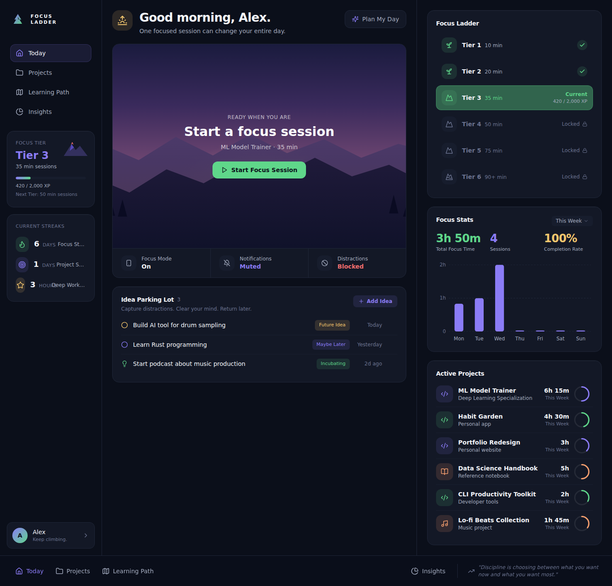
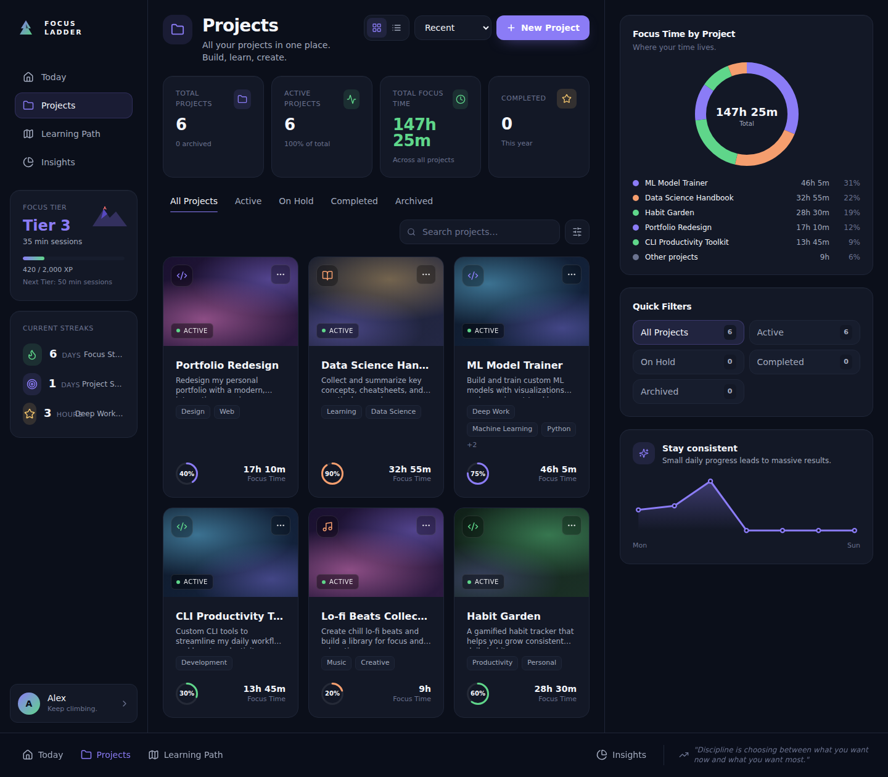
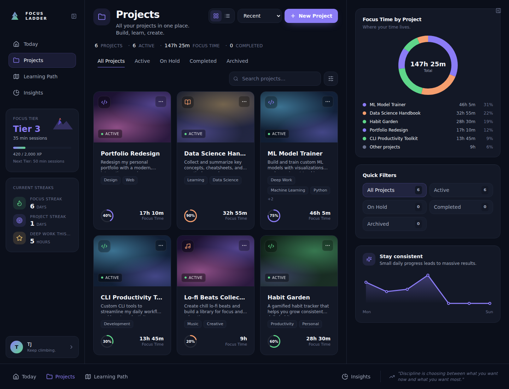
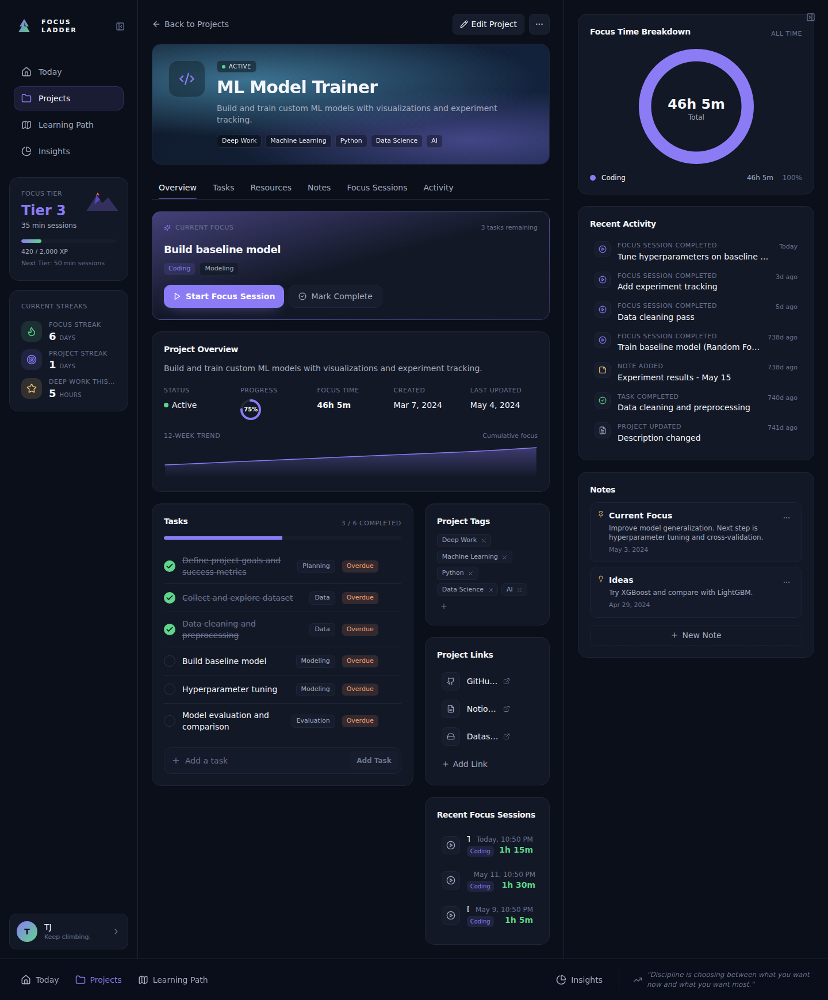
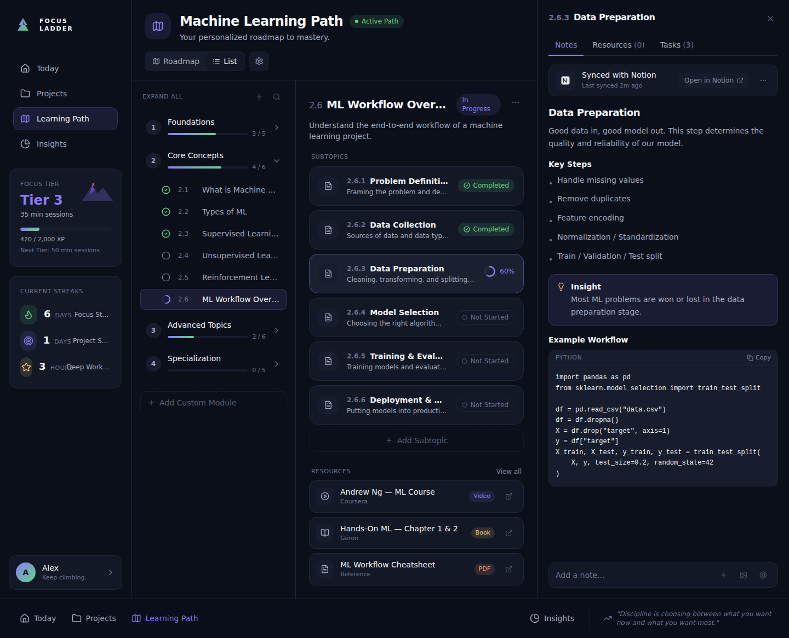
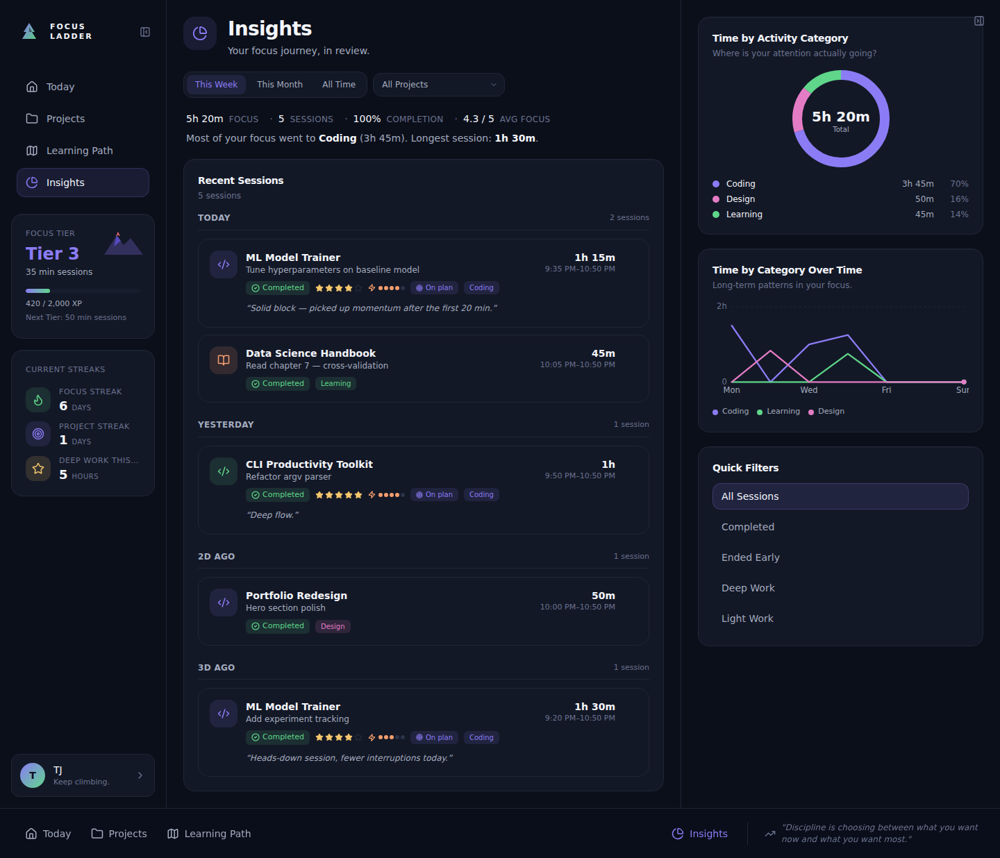

# FocusTracker — Screenshot Comparison

Before vs. after for each app route. Captured at 1440×900 by `npm run screenshots` (`scripts/screenshot-pages.mjs`).

- **Before** images live in [`screenshots-before/`](screenshots-before/).
- **After** images live in [`screenshots/`](screenshots/).
- A browser-friendly version of this comparison is in [`screenshot-comparison.html`](screenshot-comparison.html).

Jump to: [/today](#today) · [/projects](#projects) · [/projects/:id](#project-detail) · [/learning](#learning) · [/insights](#insights)

---

## Today

`/today`

| Before | After |
| --- | --- |
|  |  |

## Projects

`/projects`

| Before | After |
| --- | --- |
|  |  |

## Project detail

`/projects/ml-model-trainer`

| Before | After |
| --- | --- |
|  |  |

## Learning

`/learning`

| Before | After |
| --- | --- |
|  |  |

## Insights

`/insights`

| Before | After |
| --- | --- |
|  |  |
